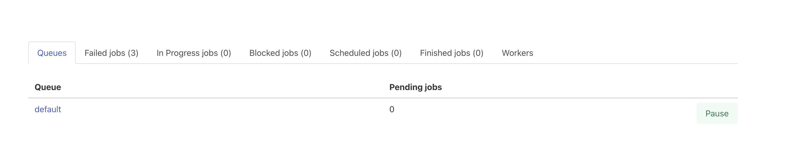
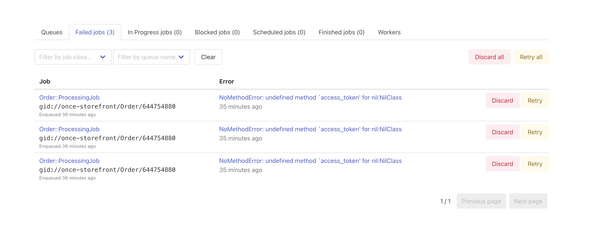
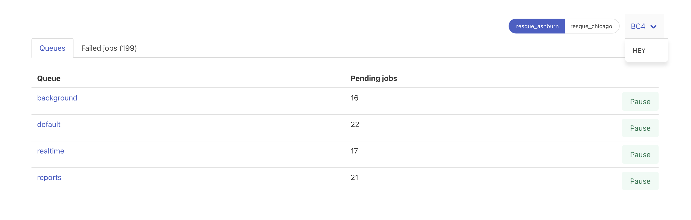
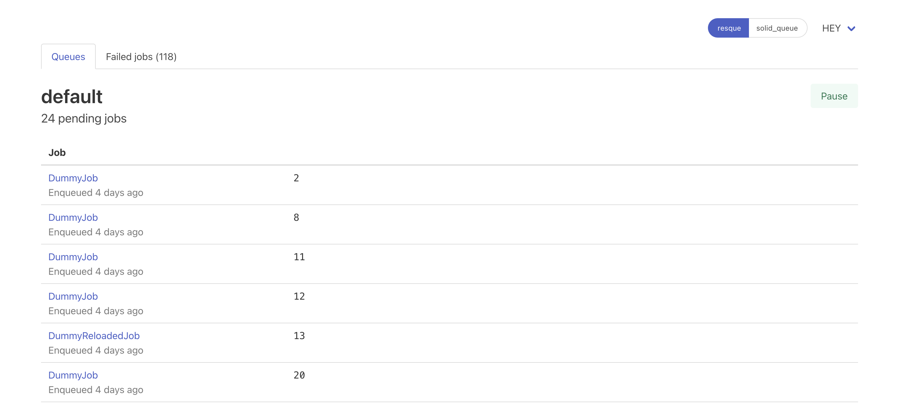
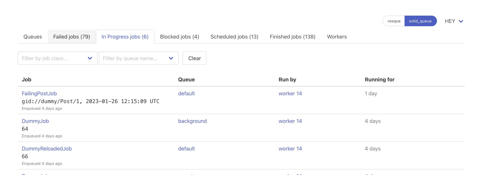
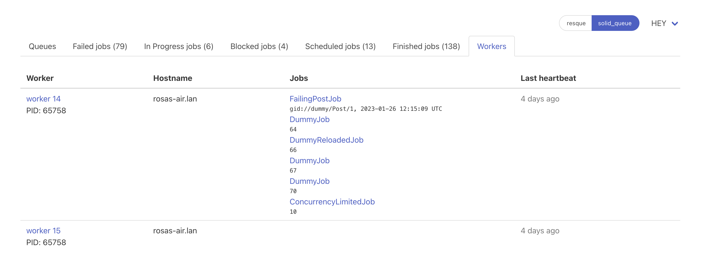
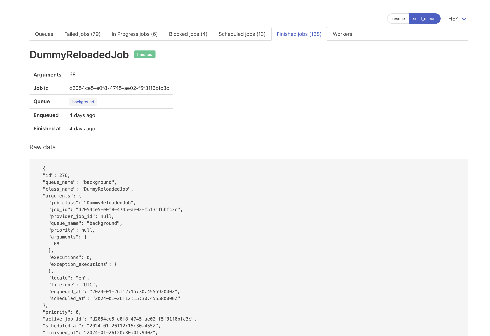
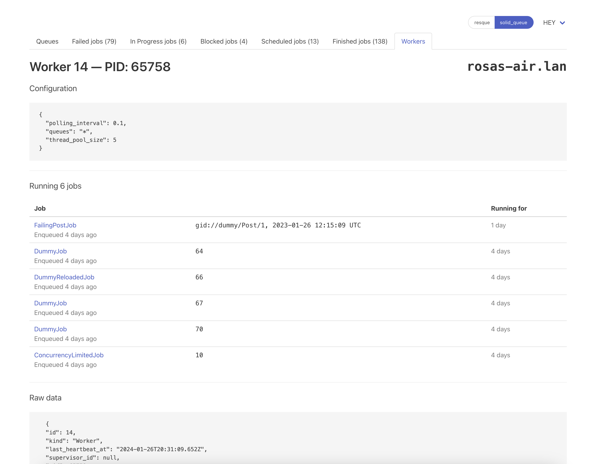

# Mission Control — Jobs

This gem provides a Rails-based frontend to Active Job adapters. It currently supports [Resque](https://github.com/resque/resque/) and [Solid Queue](https://github.com/basecamp/solid_queue). Its features depend on those offered by the adapter itself, but at a minimum, it allows you to inspect job queues, jobs currently waiting in those queues, and inspecting and retrying or discarding failed jobs.

## Installation
Add this line to your application's Gemfile:

```ruby
gem "mission_control-jobs"
```

And then execute:
```bash
$ bundle install
```

## Basic configuration

Mount Mission Control Job's engine where you wish to have it accessible from your app, in your `routes.rb` file:

```ruby
Rails.application.routes.draw do
  # ...
  mount MissionControl::Jobs::Engine, at: "/jobs"
```

And that's it. With this alone, you should be able to access Mission Control Job's UI, where you can browse the existing queues, jobs pending in these queues, jobs in different statuses, and discard and retry failed jobs:






### Authentication and base controller class

By default, Mission Control's controllers will extend the host app's `ApplicationController`. If no authentication is enforced, `/jobs` will be available to everyone. You might want to implement some kind of authentication for this in your app. To make this easier, you can specify a different controller as the base class for Mission Control's controllers:

```ruby
Rails.application.configure do
  MissionControl::Jobs.base_controller_class = "AdminController"
end
```

Or, in your environment config or `application.rb`:
```ruby
config.mission_control.jobs.base_controller_class = "AdminController"

```

### Other configuration settings

Besides `base_controller_class`, you can also set the following for `MissionControl::Jobs` or `config.mission_control.jobs`:

- `logger`:  the logger you want Mission Control Jobs to use. Defaults to `ActiveSupport::Logger.new(nil)` (no logging). Notice that this is different from Active Job's logger or Active Job's backend's configured logger.
- `delay_between_bulk_operation_batches`: how long to wait between batches when performing bulk operations, such as _discard all_ or _retry all_ jobs—defaults to `0`

This library extends Active Job with a querying interface, and the following setting:
- `config.active_job.default_page_size`: the internal batch size that Active Job will use when sending queries to the underlying adapter and the batch size for the bulk operations defined above—defaults to `1000`.

## Advanced configuration

When we built Mission Control Jobs, we did it with the idea of managing multiple apps' job backends from a single, centralized app that we used for monitoring, alerts and other tools that related to all our apps. Some of our apps run in more than one datacenter and we run different Resque instances with different Redis configurations in each. Because of this, we added support for multiple apps and multiple adapters per app. Even when running Mission Control Job within the app it manages and a single DC, as we migrated from Resque to Solid Queue, we needed to manage both adapters from Mission Control.

Without adding any additional configuration to [the one described before](#basic-configuration), Mission Control will be configured with one single app and a single server for your configured `active_job.queue_adapter`.

To change this, you can use an initializer and add the apps and their servers like this (taken from our dummy app for testing purposes):

```ruby
require "resque"
require "resque_pause_helper"

require "solid_queue"

Resque.redis = Redis::Namespace.new "#{Rails.env}", redis: Redis.new(host: "localhost", port: 6379, thread_safe: true)

SERVERS_BY_APP = {
  BC4: %w[ resque_ashburn resque_chicago ],
  HEY: %w[ resque solid_queue ]
}

def redis_connection_for(app, server)
  redis_namespace = Redis::Namespace.new "#{app}:#{server}", redis: Resque.redis.instance_variable_get("@redis")
  Resque::DataStore.new redis_namespace
end

SERVERS_BY_APP.each do |app, servers|
  queue_adapters_by_name = servers.collect do |server|
    queue_adapter = if server.start_with?("resque")
      ActiveJob::QueueAdapters::ResqueAdapter.new(redis_connection_for(app, server))
    else
      ActiveJob::QueueAdapters::SolidQueueAdapter.new
    end

    [ server, queue_adapter ]
  end.to_h

  MissionControl::Jobs.applications.add(app, queue_adapters_by_name)
end
```

This is an example for two different apps, BC4 and HEY, each one with two servers. BC4 has two Resque servers with two different configurations and HEY has one Resque server and one Solid Queue server.

Currently only one Solid Queue configuration is supported, but support for several Solid Queue backends (with different databases) [is planned](https://github.com/basecamp/mission_control-jobs/issues/35).

This is how we set Resque and Solid Queue together when we migrated from one to the other:

```ruby
queue_adapters_by_name = {
  resque: ActiveJob::QueueAdapters.lookup(:resque).new, # This will use Resque.redis as the redis client
  solid_queue: ActiveJob::QueueAdapters.lookup(:solid_queue).new
}

MissionControl::Jobs.applications.add("hey", queue_adapters_by_name)
```

When you have multiple apps and servers configured, you can choose between them with select and toggle menus:



## Basic UI usage

As mentioned, the features available in Mission Control depend on the adapter you're using, as each adapter supports different features. Besides inspecting the queues and the jobs in them, and discarding and retrying failed jobs, you can inspect jobs in different statuses supported by each adapter, filter them by _queue name_ and _job class name_ (with the idea of [adding more filters in the future](https://github.com/basecamp/mission_control-jobs/issues/30)), pause and un-pause queues (if the adapter allows that), inspect workers, know which jobs are being run by what worker, checking a specific job or a specific worker...












## Console helpers, scripting and dealing with big sets of jobs

Besides the UI, Mission Control provides a light console helper to switch between applications and adapters. Some potentially destructive actions aren't exposed via the UI (for example, discarding jobs that aren't failed, although this might change in the future) but you can always perform these from the console if you know very well what you're doing.

It's also possible that you need to deal with very big sets of jobs that are unmanageable via the UI, or that you wish to write a script to deal with an incident, some cleanup or some data migration. The console helpers and the querying API with which we've extended Active Job come handy here.

First, when connecting to the Rails console, you'll see this new message:

```
 bin/rails c


Type 'jobs_help' to see how to connect to the available job servers to manage jobs
```

Typing `jobs_help`, you'll get clear instructions about how to switch between applications and adapters:

```
>> jobs_help
You can connect to a job server with
  connect_to <app_id>:<server_id>

Available job servers:
  * bc4:resque_ashburn
  * bc4:resque_chicago
  * hey:resque
  * hey:solid_queue
```

And then:
```
>> connect_to "hey:solid_queue"
Connected to hey:solid_queue
```

Now you're ready to query and operate over jobs for this adapter via the API. Some examples of queries:

```ruby

# All jobs
ActiveJob.jobs

# All failed jobs
ActiveJob.jobs.failed

# All pending jobs in some queue
ActiveJob.jobs.pending.where(queue: "some_queue")

# All failed jobs of a given class
ActiveJob.jobs.failed.where(job_class: "SomeJob")

# All pending jobs of a given class with limit and offset
ActiveJob.jobs.pending.where(job_class: "SomeJob").limit(10).offset(5)

# For adpaters that support these statuses:
# All scheduled/in-progress/finished jobs of a given class
ActiveJob.jobs.scheudled.where(job_class: "SomeJob")
ActiveJob.jobs.in_progress.where(job_class: "SomeJob")
ActiveJob.jobs.finished.where(job_class: "SomeJob")

# For adapters that support filtering by worker:
# All jobs in progress being run by a given worker
ActiveJob.jobs.in_progress.where(worker_id: 42)
```

Some examples of bulk operations:

```ruby
# Retry all the jobs (only possible for failed jobs)
ActiveJob.jobs.failed.retry_all

# Retry all the jobs of a given class (only possible for failed jobs)
ActiveJob.jobs.failed.where(job_class: "SomeJob").retry_all

# Discard all failed jobs
ActiveJob.jobs.failed.discard_all

# Discard all pending jobs of a given class
ActiveJob.jobs.pending.where(job_class: "SomeJob").discard_all
# Or all pending jobs in a given queue:
ActiveJob.jobs.pending.where(queue_name: "some-queue").discard_all
```

When performing these bulk operations in the console, a delay of 2 seconds between batches processed will be introduced, set via [`delay_between_bulk_operation_batches`](#other-configuration-settings). You can modify it as
```ruby
MissionControl::Jobs.delay_between_bulk_operation_batches = 5.seconds
```

## Contributing

Thanks for your interest in contributing! To get the app running locally just run:
```
bin/setup
```
This will load a bunch of jobs as seeds.

We have both unit and functional tests and system tests. If you want to run system tests, you'd need to install [ChromeDriver](https://chromedriver.chromium.org/). Then, you'll be able to run the tests as:
```
bin/rails test test/system
```

## License
The gem is available as open source under the terms of the [MIT License](https://opensource.org/licenses/MIT).
